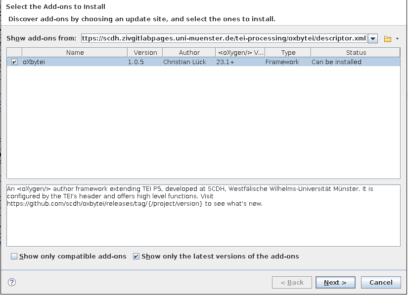

# oXbytei #

<!--


-->


oXbytei [ɔx bʌtaj] (greco-english tongue and french ears) is an oXygen
framework for editing TEI, that is configured by TEI's header. It
offers high-level functions that facilitate everyday work on TEI
documents.

- set `@xml:lang` by selecting a language registered in the header by
  [`langUsage`](https://www.tei-c.org/release/doc/tei-p5-doc/de/html/ref-langUsage.html)
- set `@ref` of `<persName>` etc. by selecting a person from a locally
  stored personography that is bound to a local URI scheme defined in
  the header by
  [`<prefixDef>`](https://www.tei-c.org/release/doc/tei-p5-doc/de/html/ref-listPrefixDef.html)

on the road map:

- places
- bibliography
- (index)
- metre of lyrics
- critical apparatus


Note: Yes, there have been some little assumptions that have poured
into this framework and blur its generality, e.g. assumptions about
sensible URI schemes for certain purposes, like `psn` or `pers` for
persons. But these are endangered animals that will become extinct as
soon as oXygen allows [parametrized
frameworks](https://www.oxygenxml.com/forum/topic23764.html).

See the section [Usage and Customization](#usage-and-customization)
for how to write TEI and setup your project in order to make use of
the framework's features.


## Package ##

### Requirements ###

oXbytei requires oXygen >= 23.1, because it makes use of an [extension
script](https://www.oxygenxml.com/doc/versions/23.1/ug-editor/topics/framework-customization-script.html)
for framework configuration.

### Installation ###

The framework can be installed with &lt;oXygen/>'s installation and
update mechanism. Therefore, the following URL has to be entered into
the form *Show addons from:* of the dialogue box from ***Help** ->
**Install new addons**...*.

<!--
[https://scdh.github.io/oxbytei/descriptor.xml](https://scdh.github.io/oxbytei/descriptor.xml)
-->

[https://scdh.zivgitlabpages.uni-muenster.de/tei-processing/oxbytei/descriptor.xml](https://scdh.zivgitlabpages.uni-muenster.de/tei-processing/oxbytei/descriptor.xml)




As an alternative, the framework can be packaged locally for
installation or it can be installed for hacking.

#### Packaging locally ####

Packaging is done with [`maven`](https://maven.apache.org/).

```{shell}
mvn package
```
	
This will create a file named `oXbytei-<VERSION>-package.zip` in the
`target` folder. This zip-File is the same as the one distributed
under the above mentioned URL.

In order to use oXbytei with older versions of oXygen, you can
generate an old-school dot-framework file from the extension script
using the *Compile Framework Extension script* as described in the
[documentation](https://www.oxygenxml.com/doc/versions/23.1/ug-editor/topics/framework-customization-script.html)
and then use local packaging.

#### Hacking / Development ####

Installing the framework as an &lt;oXygen/> package will make it
read-only. For hacking on it's code you can install it by registering
the path to the cloned repository in &lt;oXygen/>'s settings.

- 1) Clone this repository into a subfolder of an &lt;oXygen/>
  project, e.g. `oXbytei`. (It may also be sym-linked there.)

- 2) Start &lt;oXygen/> and select `Options` -> `Preferences` from the
  menu. Expand `Document Type Association` on the left and select
  `Locations [P]` under it. Click `Add` to add a new additional
  framework directory.  Enter `${pdu}/oxbytei` as directory and click
  `OK`. (Note: `${pdu}` is an [editor
  variable](https://www.oxygenxml.com/doc/versions/22.1/ug-editor/topics/editor-variables.html)
  and points to the root folder of the current project.
  
- 3) Close and restart &lt;oXygen/>. The framework is now present as an
  extension to the default TEI P5 framework.

### Regression Tests ###

There are regression tests based on
[`XSpec`](https://github.com/xspec/xspec) in `test/xspec`. The tests
can easily be run with maven from the root directory of the
repository:

```{shell}
mvn test
```

Maven will install all required packages for running the tests,
e.g. `XSpec` and `Saxon-HE`. A detailed test report can be viewed with
the browser in `target/xspec-reports/index.html`.

Note, that the tests need intermediate files to be generated in mavens
`generate-resources` phase. If you want to run the tests using saxon,
have a look at the pom-file to see what's needed.


### Releasing ###

Releases of installable packages will be created with github actions
on tags with a name matching the pattern
`v\.[0-9]+\.[0-9]+\.[0-9]+(-.*)?`,
i.e. `v<MAJOR>.<MINOR>.<BUGFIX>[-<SUFFIX>]`. To produce a release:

- first push the branch to be released
- then tag it with the tag name matching the above pattern

This will produce a release on [releases/tag/<TAG_NAME>](releases/tag)
and update the [descriptor
file](https://scdh.github.io/scdh-oxygen-framework/descriptor.xml).

NOTE: The tag name **must equal** the version name in the
[pom.xml](pom.xml)!


## Usage and Customization ##

Take a look at the folder
[`frameworks/oxbytei/samples`](frameworks/oxbytei/samples)
for sample resources, especially at the XML catalog.

### Personography ###

If there is a `<prefixDef>` in the header, which defines a URI scheme
on the protocol `psn`, `pers`, `prs`, `prsn` or `person`, an author
mode action  for
selecting a person from a personography is activated. For example, put
this in the header:

```{xml}
...
<encodingDesc>
	...
	<listPrefixDef>
		<prefixDef
			matchPattern="([a-zA-Z0-9_-]+)"
			replacementPattern="persons.xml#$1"
			ident="psn"/>
	</listPrefixDef>
	...
</encodingDesc>
```

If the linked file `persons.xml` is present, then all the persones
found in `<listPerson>` elements are presented in a selection
dialog. If the caret (pointer) is on a `<persName>` or `<person>`
element, the `@ref` attribute is updated by your selection (and
deleted if you choose the empty name). If the caret is not in such a
context, an empty fragment or a surrounding fragment like this is
created:

```{xml}
<persName ref="psn:BadraddinbalAttar">Badraddīn</persName>
```

I strongly encourage providing a personography in a local file as a
broker to global norm data on the WWW, instead of linking to triple
stores on the WWW directly from the TEI documents. See [this
discussion](https://listserv.brown.edu/cgi-bin/wa?A2=ind1711&L=TEI-L&D=0&P=43750)
on the TEI mailing list on the subject. I also encourage defining URI
schemes via
[`<prefixDef>`](https://www.tei-c.org/release/doc/tei-p5-doc/de/html/ref-listPrefixDef.html),
instead of linking to external elements by IDs directly. The prefix
definition serves as an abstraction layer, makes everything explicit,
and thus enables us to write generic tools and actions like
[](frameworks/oxbytei/externalAuthorActions/link-person.xml).


### Language and script direction ###

According to the [TEI
guidelines](https://www.tei-c.org/release/doc/tei-p5-doc/de/html/WD.html#WDWM),
the writing direction of a script should be encoded by the `@xml:lang`
attribute. Moreover, the languages, that used in a TEI encoded
document, should be listed in `teiHeader/profileDesc/langUsage`.

Here is an example header:

```{xml}
  <profileDesc xml:id="profileDesc">
	 <langUsage xml:id="langUsage">
		<language ident="ar">Arabisch</language>
		<language ident="ar-DE">Arabisch in Umschrift nach Brockelmann/Wehr</language>
		<language ident="de">Deutsch</language>
		<language ident="en">English</language>
	 </langUsage>
  </profileDesc>
```

The framework offers a functions for setting the `@xml:lang` attribute
by selecting a language from the list of languages in the header.

- `Change language` author mode action 
  - is available in the Toolbar:
	 (Note:
	The icon was desigend by Onur Mustak Cobanli an is distributed on
	[http://languageicon.org/](http://languageicon.org/) by under a CC
	licence with Relax-Attribution term.)
  - is available through content completion (Return)
  - is available in the `TEI P5` menu
- content completion is active in text mode

In order to get nice rendering in author mode, you should provide CSS
for the used languages through the project specific CSS file. Here is
an example:

```{css}
@namespace xml "http://www.w3.org/XML/1998/namespace";

[xml|lang="ar"] {
    direction: rtl !important;
}

[xml|lang="de"] {
    direction: ltr !important;
}

[xml|lang="en"] {
    direction: ltr !important;
}

[xml|lang="ar-DE"] {
    direction: ltr !important;
}
```

# License #

Copyright (c) 2021 Christian Lück

This program is free software: you can redistribute it and/or modify
it under the terms of the GNU General Public License as published by
the Free Software Foundation, either version 3 of the License, or
(at your option) any later version.

This program is distributed in the hope that it will be useful,
but WITHOUT ANY WARRANTY; without even the implied warranty of
MERCHANTABILITY or FITNESS FOR A PARTICULAR PURPOSE.  See the
GNU General Public License for more details.

You should have received a copy of the GNU General Public License
along with this program.  If not, see
[http://www.gnu.org/licenses/](http://www.gnu.org/licenses/).


## Included Software and other Material ##

The included 
icon was desigend by Onur Mustak Cobanli an is distributed on
[http://languageicon.org/](http://languageicon.org/) by under a CC
licence with Relax-Attribution term.

The framework packetized for installation ships with a copy of
[ediarum.JAR](https://github.com/ediarum/ediarum.JAR), which is
distributed under the terms of the GPL v3, written by Martin Fechner
and copyrighted by the Berlin-Brandenburg Academy of Sciences and
Humanities.
