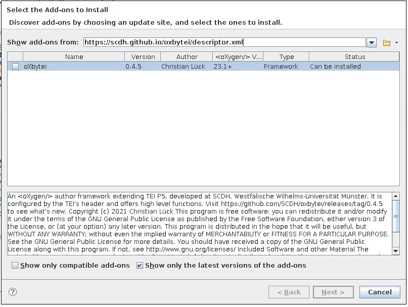

# oXbytei #


## tl;dr ##

Install from [https://scdh.github.io/oxbytei/descriptor.xml](https://scdh.github.io/oxbytei/descriptor.xml).

STATE: development, experimental

## An oXygen framework configured by TEI ##

oXbytei [ɔx bʌtaj] (greco-english tongue and french ears) is an
[oXygen](https://www.oxygenxml.com/) framework for editing
[TEI](https://tei-c.org/), that is configured by TEI's header. It
offers high-level functions that facilitate everyday work on TEI
documents.

- **Critical apparatus**: According to what is stated in
  [`<variantEncoding>`](https://www.tei-c.org/release/doc/tei-p5-doc/de/html/ref-variantEncoding.html)
  a new apparatus entry is generated from the _user selection_ and
  inserted into the document. The selected text goes into
  `<lem>`. Supported variant encodings: **all** but external
  location-referenced. [`@wit`](https://www.tei-c.org/release/doc/tei-p5-doc/de/html/ref-att.witnessed.html)
  can be selected based on the witnesses supplied via
  [`sourceDesc/listWit//witness`](https://www.tei-c.org/release/doc/tei-p5-doc/de/html/TC.html#TCAPWL).
- **Language**: Set `@xml:lang` by selecting a language registered in
  the header by
  [`langUsage`](https://www.tei-c.org/release/doc/tei-p5-doc/de/html/ref-langUsage.html)
- **Suggestions**: Set `@ref` of `<persName>`, `<placeName>` or
  `@corresp` of `<bibl>` by selecting from suggestions generated by a
  flexible plugin system. By default, locally stored referatories for
  persons etc. are used, when they are bound through a local URI
  scheme in the header using
  [`<prefixDef>`](https://www.tei-c.org/release/doc/tei-p5-doc/de/html/ref-listPrefixDef.html). The
  plugin system is flexible enough to add plugins for querying RESTful
  webservices.
- **Different markup styles**: When annotating persons, places
  etc. you can choose between markup styles: E.g. in *aggregative*
  style (default) the user selection is wrapped into an element if and
  only if the selection's start and end point are on the same parent
  node. Otherwise, each text node between is wrapped and the elements
  are linked by [`@next` and
  `@prev`](https://www.tei-c.org/release/doc/tei-p5-doc/de/html/SA.html#SAAG). Alternative
  styles include
  [`att.spanning`](https://www.tei-c.org/release/doc/tei-p5-doc/de/html/ref-att.spanning.html)
  and anchor-based markup.
- **Annotations**: Surround the _user selection_ with empty `<anchor>`
  elements carrying unique IDs and then insert a
  [`<span>`](https://www.tei-c.org/release/doc/tei-p5-doc/de/html/AI.html#AISP)
  referencing the anchors somewhere else in the document. Also select
  `span/@ana` from `<interp>` elements in the document
  (default). Other sources/references for `@ana` can be configured.
- **Multiple level inheritance**: Instead of an `oxbytei.framework`
  file, oXbytei uses an [extension
  script](https://www.oxygenxml.com/doc/versions/23.1/ug-editor/topics/framework-customization-script.html)
  as introduced in oXygen 23.1. This makes it possible to inherit from
  base frameworks on [multiple
  levels](https://www.youtube.com/watch?v=e8NwqN16p18&t=13m24s). You're
  able to write your own framework on top of oXbytei, which operates
  on top of TEI P5.

On the road map:

- **Melt and cristallize anchors**: The anchors inserted for your
  double end-point attached apparatus, for your annotations or for
  other markup, will pollute your edited text. Melting is the process
  of joining anchors, which are direct siblings, into one anchor or
  even integrating the ID into another tag. Cristallizing is the
  process of giving a referring element back its own anchors, after
  there was a melting. This is needed when a reference point to the
  edited text has to be moved.
- **Update lemma**: The content of `<lem>` may become outdated, when
  using a double end-point attached or location referenced apparatus.
- **Metre**: Selecting `@met` based on `<metDecl>` and other things
  related to lyrics.
- exploit `<tagsDecl>` etc. 
- **Index**
- ...

Read more in the [**Wiki**](https://github.com/scdh/oxbytei/wiki).

You should also have a look at
[oXbytao](https://github.com/scdh/oxbytao), which might alread extend
oXbytei to your project-specific needs.

Note: Yes, there are some little assumptions that have poured into
this framework. But they are not hard coded into it. They've just been
put into its configuration file and can be overwritten by a customized
configuration.


## Package ##

### Requirements ###

oXbytei requires oXygen >= 23.1, because it makes use of an [extension
script](https://www.oxygenxml.com/doc/versions/23.1/ug-editor/topics/framework-customization-script.html)
for framework configuration. With extension scripts you gain multiple
level inheritance and transparent updates, i.e. updates on lower level
frameworks can be installed without the need to update the stack of
frameworks based on it.

### Installation ###

The framework can be installed with &lt;oXygen/>'s installation and
update mechanism. Therefore, the following URL has to be entered into
the form *Show addons from:* of the dialogue box from ***Help** ->
**Install new addons**...*.


[https://scdh.github.io/oxbytei/descriptor.xml](https://scdh.github.io/oxbytei/descriptor.xml)

Note: The framework is not signed with a key. You can simply ignore
the warning, which oXygen throws during the installation process.




As an alternative, the framework can be packaged locally for
installation or it can be installed for hacking.

#### Packaging locally ####

Packaging is done with [`maven`](https://maven.apache.org/).

```{shell}
mvn generate-sources
mvn package
```

This will create a file named `oxbytei-<VERSION>-package.zip` in the
`target` folder. This zip-File is the same as the one distributed
under the above mentioned URL.

In order to use oXbytei with older versions of oXygen, you can
generate an old-school dot-framework file from the extension script
using the *Compile Framework Extension script* as described in the
[documentation](https://www.oxygenxml.com/doc/versions/23.1/ug-editor/topics/framework-customization-script.html)
and then use local packaging.

#### Hacking / Development ####

Installing the framework as an &lt;oXygen/> package will make it
read-only. For hacking on it's code you can install it by registering
the path to the cloned repository in &lt;oXygen/>'s settings.

- 1) Clone this repository into a subfolder of an &lt;oXygen/>
  project, e.g. `oxbytei`. (It may also be sym-linked there.)

- 2) Start &lt;oXygen/> and select `Options` -> `Preferences` from the
  menu. Expand `Document Type Association` on the left and select
  `Locations [P]` under it. Click `Add` to add a new additional
  framework directory.  Enter `${pdu}/oxbytei` as directory and click
  `OK`. (Note: `${pdu}` is an [editor
  variable](https://www.oxygenxml.com/doc/versions/22.1/ug-editor/topics/editor-variables.html)
  and points to the root folder of the current project.)

- 3) Run maven to get dependencies

```{shell}
mvn generate-sources
mvn package
```

- 4) Create symbolic links for the jar files from the folder
`target/lib` to the folder `frameworks/oxbytei`:

```{shell}
cd frameworks/oxbytei
ln -s ../../target/oxbytei.jar .
ln -s ../../target/lib/ediarum-3.1.0.jar .
ln -s ../../target/lib/slf4j-log4j12-1.7.32.jar .
ln -s ../../target/lib/slf4j-api-1.7.32.jar .
```

- 5) In your project's root folder (aka `${pd}`, see above), create a
  symbolic link to oXybytei's `frameworks/oxbytei` folder.

```{shell}
cd <project-directory>
ln -s <oXybytei-directory>/frameworks/oxbytei oxbytei
```

- 6) Close and restart &lt;oXygen/>. The framework is now present as an
  extension to the default TEI P5 framework.


Note for Windows (no symbolic links) users: Clone the framework into
your project folder in step 1. Then use
`{pd}/oxbytei/frameworks/oxbytei` in step 2. You have to copy all the
jar files from step 4. You can skip step 5 then. But you will have to
copy oxbytei.jar every time you recompile the code.


#### Logging ####

Getting logs may be the key to solving problems during development or
configuration. oXbytei uses slf4j as a logging tool and oXygen ships
with log4j, which slf4j passes its messages to. Simply running oXygen
from the commandline (instead of clicking the desktop icon) may help,
because you get the log of some error messages. To get the full logs,
one has to [turn on logging in
oXygen](https://www.oxygenxml.com/doc/versions/23.0/ug-editor/topics/problem-report-submitted-on-technical-support-form.html)
by putting a log4j config file into the application folder.

### Regression Tests ###

Besides Java unit tests there are regression tests based on
[`XSpec`](https://github.com/xspec/xspec) in `test/xspec`. The tests
can easily be run with maven from the root directory of the
repository:

```{shell}
mvn test
```

Maven will install all required packages for running the tests,
e.g. `XSpec` and `Saxon-HE`. A detailed test report can be viewed with
the browser in `target/xspec-reports/index.html`.

Note, that the tests need intermediate files to be generated in mavens
`generate-resources` phase. If you want to run the tests using saxon,
have a look at the pom-file to see what's needed.


### Releasing ###

Releases of installable packages will be created with github actions
on tags with a name matching the pattern
`[0-9]+\.[0-9]+\.[0-9]+(-.*)?`,
i.e. `<MAJOR>.<MINOR>.<BUGFIX>[-<SUFFIX>]`. But only tags matching the
pattern `[0-9]+\.[0-9]+\.[0-9]+` will result in an update of the
descriptor file.--So, releases with a suffix are considered kind of
beta and will only occur in the tag's release bundle.

To produce a release:

- first push the branch to be released
- then tag it with the tag name matching the above pattern

This will produce a release on [releases/tag/<TAG_NAME>](releases/tag)
and update the [descriptor
file](https://scdh.github.io/oxbytei/descriptor.xml).

NOTE: The tag name **must equal** the version in the
[pom.xml](pom.xml) file for releases that update the descriptor file
(i.e. releases that match the pattern `[0-9]+\.[0-9]+\.[0-9]+`)!

## Design principles ##

- Installation and updating must be simple, i.e. no additional tools
  and compilers required.

- Keep things flexible through configuration.

- The default configuration must be reasonable.

### Design Principles regarding the Java code base ###

- Keep the Java code base that depends on oXygen as small as possible
  und put it in the namespace `de.wwu.scdh.oxbytei`!

  - Code for user interaction also belongs to here.

  - Offer content completion in text mode *and* in author mode.

- Source out as much business logic as possible to the namespace
  `de.wwu.scdh.teilsp`!

  - Keep things extensible.

  - Use plugins based on Java's SPI to provide suggestions for content
    completion.

	- No user interaction allowed in such plugins, but their
      interfaces distinguish between intialization phase and query
      phase, so that user interaction can be done in oXbytei.

  - Do not hardcode assumptions about TEI usage – and not about
    whether this XML dialect is used at all either – into Java
    classes.

    - Exception: Plugins

  - Put all such assumptions into the configuration file.

So` de.wwu.scdh.teilsp` contains code which is not specific to the
oXygen editor. It serves as a layer of abstraction and can be plugged
into other editors, too. It's intended to be the germ of a TEI
[LSP](https://langserver.org/) implementation based on Lemminx and
will be sourced out to it's own repository in the future.

It provides the interfaces for plugins and the plugin loader, which
evaluates the current editing context for loading and initializing
plugins. So plugins can be developed for this layer of abstraction.

### Design principles regarding other oXygen framework components ###

- Offer recursively defined author mode actions.

  - Reason: This allows atomization of editing actions. So frameworks
    deriving (based on) oXbytei can have a minimal codebase for
    overriding single editing atoms.

  - Get feedback: Are they accepted by the users?


## Plugins ##

oXbytei makes use of Java's SPI for loading plugins. There is a plugin
interface for providers of pairs of keys and labels, e.g. global
identifiers and readable names of persons documented in a norm data
repository. They are used in the functions for linking persons, places
etc.

Existing plugins:

- `de.wwu.scdh.teilsp.extensions.LabelledEntriesFromXML`: Read from
  the XML file currently edited and provide suggestions.

- `de.wwu.scdh.teilsp.extensions.LabelledEntriesFromXMLByPrefixDef`:
  Get an URL from a `<prefixDef>` in the currently edited document,
  open this URL und provide suggestions from it. Note, that this can
  be used to refer to external documents, the URL of which is not
  given in a `<prefixDef>`.

Plugins on the road map:

- Suggestions from JSON, XSLT, also from remote documents.

TODO: Expand oXygen's editor variables in the configuration file,
which would allow an additional level of user interaction, e.g. for
passing user credentials when fetching resources over a network.


# License #

Copyright (c) 2021 Christian Lück

This program is free software: you can redistribute it and/or modify
it under the terms of the GNU General Public License as published by
the Free Software Foundation, either version 3 of the License, or
(at your option) any later version.

This program is distributed in the hope that it will be useful,
but WITHOUT ANY WARRANTY; without even the implied warranty of
MERCHANTABILITY or FITNESS FOR A PARTICULAR PURPOSE.  See the
GNU General Public License for more details.

You should have received a copy of the GNU General Public License
along with this program.  If not, see
[http://www.gnu.org/licenses/](http://www.gnu.org/licenses/).


## Included Software and other Material ##

The included 
icon was desigend by Onur Mustak Cobanli an is distributed on
[http://languageicon.org/](http://languageicon.org/) by under a CC
licence with Relax-Attribution term.

The framework packetized for installation ships with a copy of
[ediarum.JAR](https://github.com/ediarum/ediarum.JAR), which is
distributed under the terms of the GPL v3, written by Martin Fechner
and copyrighted by the Berlin-Brandenburg Academy of Sciences and
Humanities.
